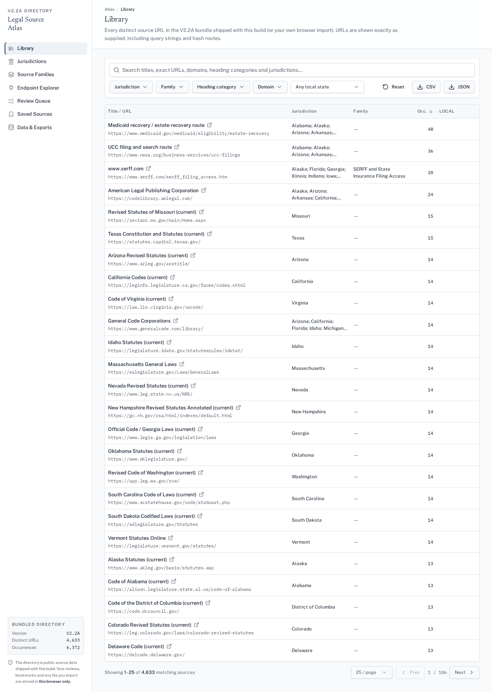

# Legal Source Atlas — verification report (2026-09-30)

Scope: fix default data loading and persistence for the first version. The project is unpublished and nothing was deployed.

## Supplied file identity (read this first)
| | Expected (from request) | Actual file on disk |
|---|---|---|
| Size | 6,431,110 bytes | **6,539,722 bytes** |
| SHA-256 | bab51fdd…9eacf | **acb1355f66463d76e865e582a2a3cc3e62a235fe0ffa19eb69ea80fb3e7b7b3e** |

The only uploaded file (`/mnt/user-uploads/atlas-import-bundle.json`) does **not** match the size and hash in the request.
Its row counts do match every expected value (4,633 / 6,372 / 258 / 8 / 73 / 4 original files).
It was copied unchanged to `public/data/atlas-import-bundle.json` (`cmp` identical), and the production build output is also 6,539,722 bytes.
Tests pin the **actual** hash. If a different file was intended, please re-supply it.

## Commands and results (final code)
| Command | Result |
|---|---|
| `bunx vitest run` | 7 files, **65 / 65 tests passed** |
| `bunx tsgo --noEmit` | no errors |
| `bun run build` | exit 0; `dist/client/data/atlas-import-bundle.json` 6,539,722 bytes |
| `python3 docs/verify_atlas.py` (Playwright, fresh context, no manual import) | **49 / 49 checks passed** |

Tests written first (they failed before the fix because the modules were missing): `persistence.test.ts` and `families.test.ts`.
They read the bundled project file directly, so real-data tests never skip.

## Browser checks (fresh context, output of docs/verify_atlas.py)
```
    PASS fresh: distinct 4,633 
    PASS fresh: occurrences 6,372 
    PASS library pager shows 4,633 rows 
    PASS data-exports Endpoint candidates=258 
    PASS data-exports Manifest families=8 
    PASS data-exports Imported promotions=73 
    PASS data-exports Distinct source URLs=4,633 
    PASS data-exports Original occurrences=6,372 
    PASS no 'mismatch' 
    PASS title literal fixed 
    PASS origin bundled 
    PASS data-exports no horizontal overflow 
    PASS raw download sha matches bundled acb1355f66463d76e865e582a2a3cc3e62a235fe0ffa19eb69ea80fb3e7b7b3e
    PASS JSON export keeps raw record + occurrences array 
    PASS original file text downloadable 1000642
    PASS after reload still 4,633 
    PASS hash URL preserved in link https://www.generalcode.com/library/#CT
    PASS query URL link retains ? https://lis.njleg.state.nj.us/nxt/gateway.dll?f=templates&fn=default.htm&vid=Publish%3A10.1048%2FEnu
    PASS drawer link equals row link https://lis.njleg.state.nj.us/nxt/gateway.dll?f=templates&fn=default.htm&vid=Publish%3A10.1048%2FEnu
    PASS short reason rejected (no overlay) 
    PASS review saved with reason 
    PASS undo removes overlay 
    PASS bookmark persisted after reload {"src_4d8e8366596ac73c6f47":true}
    PASS review persisted after reload 
    PASS no bundle in localStorage 
    PASS Saved Sources shows bookmark after reload 
    PASS nav Library 
    PASS nav Jurisdictions 
    PASS nav Source Families 
    PASS 8 family cards unassigned (4,525)
    PASS nav Endpoint Explorer 
    PASS endpoint explorer has rows 
    PASS nav Review Queue 
    PASS review queue lists 1 
    PASS nav Saved Sources 
    PASS nav Data & Exports 
    PASS no page errors 
    PASS legacy migrated and legacy key removed after IDB write 
    PASS bookmarks kept during migration 
    PASS migrated import survives reload (from IndexedDB) 
    PASS restore bundled with confirmation 
    PASS bookmarks kept on restore 
    PASS restore survives reload 
    PASS user import saved in IndexedDB survives reload 
    PASS rejected save shown explicitly 
    PASS after failed save, reload shows bundled (no false claim) 
    PASS rejected bookmark save warned 
    PASS load failure shows error (not empty library) 
    PASS Retry recovers 
```

## Screenshot


## Behaviour now
- **Startup order:** saved IndexedDB import → legacy localStorage import → bundled file.
  - A legacy import is migrated only after the IndexedDB write has been verified, and only then is the old key removed.
  - Stale async loads are discarded, so they cannot overwrite a newer import, restore or clear.
- **User imports:** stored as exact raw bytes in IndexedDB, including unknown fields and all original file text.
- **Storage failures:** a failed IndexedDB or localStorage write is reported and never shown as "saved". A failed load shows an error with Retry, never an empty library.
- **Reviews and bookmarks:** kept in localStorage and written only by user actions, so startup cannot wipe them. Import and restore leave them untouched; only the confirmed "Clear local reviews & bookmarks" button removes them.
- **Downloads:** the original bundle file (byte-identical), each original file's text, and CSV/JSON exports. JSON rows include the verbatim raw record.

## Remaining limits
- Family membership for directory sources uses only exact rules: a heading category equals the family name, or the exact URL appears among the family's endpoints. Result: 108 linked, 4,525 unassigned, 0 ambiguous. Nothing is guessed.
- Imported verification, currentness and promotion labels are historical metadata. No source was fetched or re-checked.
- Browser state is per browser and per device; nothing is synced.
- The bundled 6.5 MB file is downloaded on each visit that has no saved import. There is no service-worker cache.
- The file hash differs from the one in the request (see above).
